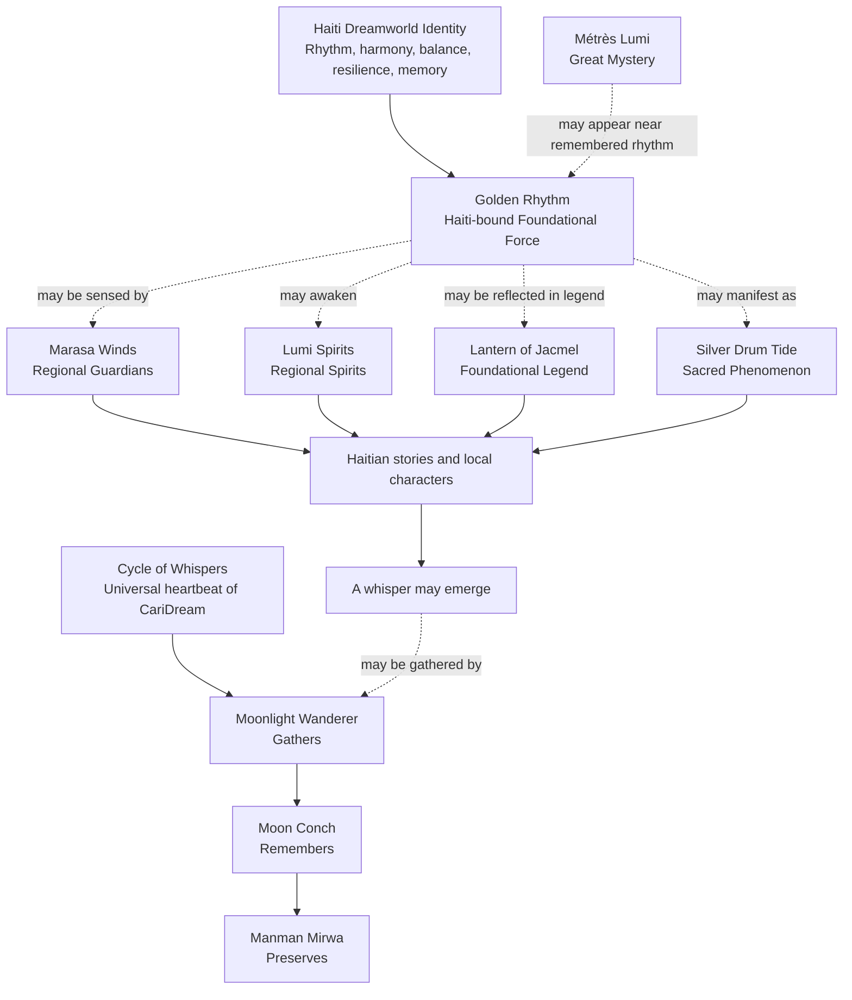

# Haiti Canon Boundaries

## Version 1.0

**Applies to:** `Whispers of the Golden Rhythm`  
**Document type:** Canon governance and authority boundaries  
**Status:** Canon; promoted June 11, 2026

**Governed by:** [CariDream World Bible Canon Edition v2.5](./CARIDREAM-WORLD-BIBLE.md)

**Related archive:** [CariDream Lore Vault](./CARIDREAM-LORE-VAULT.md)

This document defines the binding authority limits, continuity protections, and protected uncertainties for Haiti's canonical Dreamworld mythology. The World Bible remains the final source of truth.

The mythology governed here consists only of:

- The Golden Rhythm
- Métrès Lumi
- The Marasa Winds
- The Lumi Spirits
- The Silver Drum Tide
- The Lantern of Jacmel
- The Major Series `Whispers of the Golden Rhythm`

## Governing Principles

1. The Cycle of Whispers remains the heartbeat of the entire CariDream Dreamworld.
2. The Golden Rhythm is foundational to Haiti's Dreamworld identity only.
3. Manman Mirwa, the Moonlight Wanderer, and the Moon Conch retain their fixed and exclusive responsibilities.
4. Haitian concepts may reveal, express, sense, or respond to rhythm and memory. They may not gather, universally remember, or preserve whispers.
5. No Haitian concept governs the Great Spirits or supplies the hidden source of another island's identity.
6. Haiti contributes rhythm, harmony, balance, resilience, and living memory to the Dreamworld without claiming ownership of rhythm throughout the Caribbean.
7. All protected mysteries remain unanswered.
8. Stories must continue to follow Never Teach the Lesson, Wonder Over Fear, Sleep First, Caribbean First, and the Island Rule.

# Part I: Haiti's Canon Identity

## Core Whisper

> Every rhythm carries a memory.

## Core Themes

- Rhythm
- Harmony
- Balance
- Resilience
- Memory

## Dreamworld Voice

- Reflective
- Moonlit
- Musical
- Gentle
- Emotionally grounding

## Unique Contribution

Haiti's Dreamworld identity understands rhythm as a living way that memory may be felt, shared, interrupted, answered, and renewed.

This contribution is distinct from:

- The Cycle of Whispers, which connects all stories and islands.
- The Moon Conch, which remembers whispers.
- Manman Mirwa, who preserves whispers.
- The Great Spirits, which embody universal natural qualities.
- Other islands' unique relationships with forest, ocean, direction, sacred rest, landscape, or mystery.

Haiti may recognize echoes of rhythm across the Caribbean. It may not claim that every island's identity originates in the Golden Rhythm.

# Part II: Canon Boundaries

## The Golden Rhythm

**Classification:** Foundational Force  
**Scope:** Haiti's Dreamworld identity  
**Nature:** Ancient, majestic, eternal, and unowned

### What It Is

The Golden Rhythm is the foundational force through which Haiti's Dreamworld identity experiences rhythm, harmony, resilience, balance, and memory.

It may be perceived through drums, waves, lantern light, memory, silence, movement, or other expressions already established by the mythology.

It exists without a known creator or owner.

### What It Is Not

The Golden Rhythm is not:

- A character
- A spirit
- A Great Spirit
- A Guardian
- A Keeper of Whispers
- A Sacred Phenomenon
- A conscious ruler
- A source of commands
- A replacement for the Cycle
- The universal heartbeat of CariDream
- The origin of every island's rhythm, memory, or identity

### Authority It Has

The Golden Rhythm may:

- Serve as Haiti's foundational Dreamworld identity.
- Be sensed, heard, reflected, remembered, interrupted, or restored within Haitian stories.
- Provide the shared thematic foundation for Haitian Guardians, Regional Spirits, Sacred Phenomena, legends, and stories.
- Be present without acting as a conscious being.
- Allow harmony already present within a Haitian story to become perceptible.

### Authority It Does Not Have

The Golden Rhythm may not:

- Gather whispers.
- Remember whispers on behalf of the Dreamworld.
- Preserve whispers.
- Create whispers by authority.
- Create new stories, dreams, paths, or adventures through Manman Mirwa's function.
- Command people, spirits, Guardians, Great Spirits, nature, or events.
- Determine fate or compel harmony.
- Open portals or permit realm travel.
- Grant powers.
- Govern time, dreams, memory, moonlight, water, wind, or fire.
- Explain or resolve any Great Mystery.
- Replace an island's distinct cultural or spiritual identity.

### Relationship to the Cycle of Whispers

The Golden Rhythm exists within the Dreamworld governed by the Cycle.

The Cycle remains universal.

The Golden Rhythm provides a Haiti-specific way through which an experience may become meaningful enough to form a whisper. It does not perform any fixed responsibility of the Cycle.

When a whisper emerges:

- The Moonlight Wanderer may gather it.
- The Moon Conch may remember it.
- Manman Mirwa may preserve it.

The Golden Rhythm performs none of these three acts.

### Relationship to Whispers

The Golden Rhythm may accompany the circumstances in which a whisper is born.

It may make a forgotten or interrupted rhythm perceptible.

It does not own, summon, collect, store, judge, or preserve the resulting whisper.

### Relationship to Memory

The Golden Rhythm allows memory to be experienced through rhythm.

It does not contain a complete archive of memory.

It does not restore every forgotten fact or guarantee perfect recollection.

It does not replace the Moon Conch's responsibility as the Living Memory of the Dreamworld.

## Métrès Lumi

**Classification:** Great Mystery  
**Scope:** A recurring luminous uncertainty that may be seen throughout the Caribbean Dreamworld  
**Protected status:** Her explanation must remain permanently unresolved

### What She May Do

Métrès Lumi may:

- Appear briefly and gently.
- Be witnessed where a forgotten rhythm is about to be remembered.
- Be associated by observers with moonlight, rhythm, memory, or the Golden Rhythm.
- Leave witnesses uncertain about what they experienced.
- Be remembered differently by different people, communities, and islands.
- Appear without causing or resolving the story's central event.
- Deepen wonder through presence alone.

### What She May Not Do

Métrès Lumi may not:

- Command.
- Guide travelers.
- Gather whispers.
- Remember whispers for the Cycle.
- Preserve whispers.
- Create whispers.
- Restore harmony through intervention.
- Solve a character's problem.
- Reveal hidden truth as an authority.
- Open thresholds, pathways, portals, or crossings.
- Determine destinations.
- Embody a universal natural domain.
- Govern moonlight, memory, rhythm, dreams, or the Golden Rhythm.
- Replace Manman Mirwa, the Moonlight Wanderer, the Moon Conch, the Gatekeeper, the Old Walker, or a Great Spirit.

### Protected Unknowns

No official answer may establish:

- Her origin.
- Her true nature.
- Whether she follows the Golden Rhythm.
- Whether the Golden Rhythm follows her.
- Why she appears.
- Whether different witnesses see the same presence.
- Whether she is connected to another Great Mystery.
- Whether she remembers what others have forgotten.

Stories may suggest possibilities. No possibility may become the definitive explanation.

### Relationship to Memory, Rhythm, and Whispers

Métrès Lumi may appear near the moment when memory and rhythm become perceptible.

Her appearance does not cause the memory, create the rhythm, or produce the whisper by authority.

She does not carry the resulting whisper into the Cycle.

## The Marasa Winds

**Classification:** Regional Guardians  
**Region:** Haiti's Dreamworld  
**Themes:** Balance, harmony, companionship, rhythm  
**Role:** Guardians of harmony

### Scope of Influence

The Marasa Winds care for balance and harmony within Haiti's Dreamworld stories, places, and relationships.

Their authority is regional and relational.

They may sense changes within the Golden Rhythm and recognize Métrès Lumi without understanding her.

### Guardian Responsibilities

The Marasa Winds may:

- Sense when established rhythms move out of balance.
- Attend to harmony through presence, companionship, and responsive movement.
- Help story characters notice relationships among distinct rhythms.
- Protect space in which balance may return naturally.
- Demonstrate companionship without erasing difference.
- Respond to the Golden Rhythm without controlling it.

### Boundaries

The Marasa Winds may not:

- Command the Golden Rhythm.
- Manufacture harmony.
- Force reconciliation.
- Control ordinary weather throughout Haiti.
- Govern all wind.
- Guide travelers by direction.
- Open or control crossings.
- Determine fate, destination, or choice.
- Command Lumi Spirits.
- Explain Métrès Lumi.
- Gather, remember, preserve, or create whispers.
- Replace the Divi-Divi Spirits, Gatekeeper, Great Spirits, or Moonlight Wanderer.
- Operate as universal Guardians outside Haiti.

### Relationship to Harmony and Rhythm

The Marasa Winds recognize changes in harmony. They do not define harmony for others.

They may help distinct rhythms remain in relationship without requiring those rhythms to become identical.

Harmony must emerge through the story's people, place, memory, community, or natural relationships. It may not be imposed by Guardian authority.

## The Lumi Spirits

**Classification:** Regional Spirits  
**Title:** Children of the Moonlit Glow  
**Region:** Haiti's Dreamworld  
**Role:** Spirits of remembered rhythm

### Regional Spirit Role

Regional Spirits are local presences that respond to a region's established identity.

Unlike Great Spirits, they do not embody universal forces.

Unlike Regional Guardians, they do not maintain care or balance across a story realm.

The Lumi Spirits awaken when moonlight touches a living rhythm in the places already established by the mythology.

### Authority They Have

The Lumi Spirits may:

- Awaken in response to a living rhythm.
- Reveal that a hidden or forgotten rhythm is present.
- Appear through local light, movement, sound, or atmosphere.
- Draw attention toward rhythm without guiding a destination.
- Reflect remembered rhythm without containing complete memory.
- Participate in Haiti-specific stories as regional presences.

### Authority They Do Not Have

The Lumi Spirits may not:

- Create the Golden Rhythm.
- Create living rhythm by authority.
- Govern moonlight, lanterns, mountains, rivers, shores, wind, or memory.
- Embody guidance, adaptability, wisdom, hope, or imagination universally.
- Maintain harmony as Guardians.
- Command people, nature, other spirits, or one another.
- Gather, permanently remember, preserve, or create whispers.
- Grant powers.
- Open portals.
- Transport characters between realms.
- Replace the Great Spirits, Marasa Winds, Moon Conch, or Manman Mirwa.

### Relationship to Rhythm

The Lumi Spirits follow and reveal rhythm.

They do not own, originate, direct, or complete it.

Their presence confirms that a rhythm is living within the story; it does not determine what the rhythm means.

### Relationship to Memory

The Lumi Spirits may reveal the felt presence of remembered rhythm.

They are not memory archives.

They do not restore exact historical knowledge, remove loss, or guarantee recollection.

They do not carry memory between all islands.

## The Silver Drum Tide

**Classification:** Sacred Phenomenon  
**Region:** Haiti's Dreamworld  
**Nature:** A rare sacred manifestation of the Golden Rhythm

### What Occurs

During the Silver Drum Tide, the forms already established by the mythology move in perceptible harmony:

- The sea moves like a heartbeat.
- The mountains hum.
- Lanterns flicker in harmony.
- The Marasa Winds grow quiet.

The phenomenon reveals harmony already present.

### What Does Not Occur

The Silver Drum Tide does not:

- Grant powers.
- Change reality by authority.
- Create harmony.
- Create the Golden Rhythm.
- Create, collect, remember, or preserve whispers.
- Open a doorway to the Realm of Rest.
- Open any portal.
- Enable realm travel.
- Carry characters into dreams.
- Control dreams or sleep.
- Restore the dead or recreate the past.
- Reveal objective answers to mysteries.
- Summon or command Métrès Lumi.
- Transform the Marasa Winds or Lumi Spirits.
- Replace the Green Flash or another Sacred Phenomenon.

### Sacred Rarity

The Silver Drum Tide must remain rare enough that its appearance retains sacred significance.

It may not become:

- A routine climax.
- A predictable response to every restored rhythm.
- A power activated by a character.
- A reward for moral correctness.
- A spectacle required in every series arc.

Its arrival must remain outside ordinary control.

### Relationship to the Golden Rhythm

The Silver Drum Tide is a manifestation of the Golden Rhythm, not its source, container, owner, or complete expression.

The Golden Rhythm may exist without the Silver Drum Tide appearing.

The phenomenon reveals an existing harmony for a brief time and then passes.

## The Lantern of Jacmel

**Classification:** Foundational Legend  
**Location:** Jacmel, Haiti  
**Role:** The first legend associated with the Golden Rhythm

### Cultural and Regional Significance

The Lantern of Jacmel belongs specifically to Jacmel's artistic, communal, coastal, and memory-centered Dreamworld identity.

It must remain connected to Jacmel rather than becoming a universal Caribbean artifact.

Its use must distinguish Jacmel's creative memory from:

- Cap-Haitien's historical and generational lantern imagery.
- Aruba's maritime lighthouse guidance.
- Saint Lucia's harbor homecoming light.
- The Fire Spirit's universal domain of guidance.
- The Gatekeeper's uncertain association with thresholds and lantern-bearing.

### Relationship to the Golden Rhythm

The legend may suggest that the lantern reflected the Golden Rhythm.

The lantern does not:

- Contain the Golden Rhythm.
- Create the Golden Rhythm.
- Control the Golden Rhythm.
- Activate the Silver Drum Tide.
- Grant access to the Golden Rhythm.

### Relationship to Métrès Lumi

The legend may suggest that the lantern reflected Métrès Lumi.

It may not prove that:

- Métrès Lumi created the lantern.
- The lantern summoned her.
- Her essence resides within it.
- The lantern explains her origin or nature.
- Every appearance of its glow indicates her presence.

### Protected Uncertainty

No official version may determine whether:

- An artisan created the lantern.
- Its glow reflected Métrès Lumi.
- It reflected the Golden Rhythm.
- The story began as a dream.
- Any surviving lantern is the original.

Contradictory versions may coexist without one becoming definitive.

### Artifact Boundaries

The Lantern of Jacmel may not:

- Become a universal Dreamworld artifact.
- Guide ordinary travel.
- Open thresholds or portals.
- Reveal objective truth.
- Store all memory.
- Preserve whispers.
- Command Spirits or Guardians.
- Appear as required equipment in every Haitian story.

# Part III: Authority Map

The hierarchy below describes responsibility, not power.

## Authority Summary

| Concept | May | May Not |
|---|---|---|
| Golden Rhythm | Found Haiti's regional identity; be sensed or expressed | Govern the Dreamworld; perform Cycle responsibilities |
| Métrès Lumi | Appear and deepen uncertainty | Guide, intervene, explain, gather, remember, or preserve |
| Marasa Winds | Care for Haiti-specific harmony | Control wind, force balance, guide travel, or command |
| Lumi Spirits | Reveal living remembered rhythm | Act as Great Spirits, Guardians, memory archives, or authorities |
| Silver Drum Tide | Reveal existing harmony briefly | Grant powers, open realms, create harmony, or become routine |
| Lantern of Jacmel | Sustain a Jacmel-specific unresolved legend | Become a universal artifact, portal, guide, or memory vessel |

# Part IV: Overlap Protection

## Manman Mirwa

**Protected responsibility:** Preserves whispers and renews wonder through joyful remembrance.

No Haitian concept may:

- Preserve whispers.
- Create new stories through silver tears.
- Become the spiritual heart of the entire Dreamworld.
- Receive completed journeys in Manman Mirwa's place.

Métrès Lumi's luminous feminine presence must never imply that she is a regional version, reflection, counterpart, daughter, rival, or hidden form of Manman Mirwa.

## Moon Conch

**Protected responsibility:** Remembers whispers and carries them home.

The Golden Rhythm and Lumi Spirits may make memory perceptible. They may not:

- Store all memories.
- Carry whispers between islands.
- Function as reliable archives.
- Replace the Moon Conch as Living Memory.

## Moonlight Wanderer

**Protected responsibility:** Gathers whispers and serves as audience guide.

Within `Whispers of the Golden Rhythm`, the Wanderer may listen, witness, ask, and gather.

The Wanderer may not:

- Restore harmony.
- Direct the Marasa Winds.
- Cause Lumi Spirits to awaken.
- Summon the Silver Drum Tide.
- Solve Métrès Lumi's mystery.
- Replace Haitian local characters as the emotional center.

## Gatekeeper

**Protected uncertainty:** Symbolic association with thresholds, crossings, roads, tides, and journeys.

Haitian concepts may not:

- Open supernatural crossings.
- Control thresholds.
- Determine destinations.
- Confirm that Métrès Lumi or the Lantern is connected to the Gatekeeper.

The Lantern of Jacmel expresses creative and remembered rhythm, not passage or navigation.

## Old Walker

**Protected uncertainty:** A traveler remembered differently throughout the Caribbean.

Métrès Lumi and the Old Walker may appear within the same wider Dreamworld without any confirmed relationship.

No story may establish:

- A shared origin.
- A hierarchy between them.
- That one follows the other.
- That either explains the other's identity.

Métrès Lumi is associated with remembered rhythm. The Old Walker remains associated with unresolved travel and changing remembrance.

## Great Spirits

**Protected responsibility:** Universal natural forces expressed consistently throughout the Dreamworld.

The Golden Rhythm is Haiti-bound and does not become a sixth Great Spirit.

The Lumi Spirits are regional presences and do not embody universal domains.

The Marasa Winds are regional caretakers and do not govern universal wind, balance, or rhythm.

The following distinctions are binding:

- Fire Spirit guides universally; Haitian lanterns do not replace that domain.
- Water Spirit embodies adaptability; the Silver Drum Tide does not govern water.
- Forest Spirit embodies wisdom; Haitian rhythm does not become universal wisdom.
- Star Spirit embodies hope; moonlit glow does not become a second hope domain.
- Dream Spirit embodies imagination; Métrès Lumi does not govern dreams.

## Existing Guardians

The Marasa Winds remain distinct from:

- Papa Bois, who cares for Trinidad and Tobago's forest wisdom.
- The Sea Turtle, who keeps ocean stories and belonging.
- La Diablesse, who cares for quiet paths and reflection.
- Divi-Divi Spirits, who provide specifically Aruban direction to travelers.
- Cigua Spirits, who express Dominican rest, comfort, and protection.
- Silver Ribbon Spirits, who care for Grenadian rivers, waterfalls, rhythm, and bodily calm.

The Marasa Winds care for Haiti-specific relational harmony. They do not inherit another Guardian's environment, travel role, or emotional domain.

## Existing Sacred Phenomena

The Silver Drum Tide remains distinct from the Green Flash:

| Green Flash | Silver Drum Tide |
|---|---|
| Barbados | Haiti |
| Brief doorway to the Realm of Rest | Brief revelation of existing harmony |
| Grants a night of peaceful sleep | Grants no power or guaranteed effect |
| Associated with a horizon event | Expressed through synchronized rhythm in established forms |

The Silver Drum Tide is also distinct from the Silver Ribbon Spirits. The former is a rare Haitian event; the latter are Grenadian caretakers of moving water.

## Existing Haiti Stories

The proposed flagship series must preserve the identities already established in the story library.

### Citadel Dreams

The northern stories retain:

- Freedom
- National and generational remembrance
- Historical dignity
- Mountains, architecture, family, and continuity

The Golden Rhythm may provide a future thematic relationship to memory. It may not replace specific Haitian history with generalized magical rhythm.

### Golden Nights of Jacmel

The Jacmel stories retain:

- Artistry
- Fireflies
- Coastal reflection
- Community imagination
- Southern regional identity

The Lantern of Jacmel may become their foundational legend after canon promotion. Existing stories need not imply that every light is a Lumi Spirit or an appearance of Métrès Lumi.

### Drums Beneath the Stars

This story may resonate naturally with the Golden Rhythm.

It must remain grounded in family and community rather than becoming retroactive proof of every mythological claim.

### Existing Story Protection

Canon promotion must not automatically rewrite existing stories.

Connections may be added only when they:

- Preserve the original emotional meaning.
- Respect cultural and historical specificity.
- Do not convert every rhythm, lantern, tide, or memory into supernatural evidence.
- Do not make the mythology mandatory for understanding a standalone story.

# Part V: Long-Term Franchise Safeguards

## Sustainable Story Range

`Whispers of the Golden Rhythm` can support long-term expansion if stories vary the relationship among rhythm, memory, harmony, silence, interruption, and return.

The series must not require the same sequence in every episode.

The following elements are optional, not mandatory:

- A Marasa Winds appearance
- A Lumi Spirit awakening
- Métrès Lumi
- The Silver Drum Tide
- The Lantern of Jacmel
- The Moonlight Wanderer

No single element must appear in every story.

## Repetition Protections

Future stories should avoid:

- Treating every disagreement as a broken rhythm.
- Making restored harmony mean complete agreement.
- Using drums as the only expression of Haitian rhythm.
- Using lanterns as the only expression of memory.
- Resolving every story through supernatural appearance.
- Turning resilience into endless suffering.
- Making Métrès Lumi's appearance a predictable reward.
- Using the Silver Drum Tide as a season-ending requirement.

## Geographic and Cultural Range

The flagship series may connect Haitian regions and communities while preserving their differences.

Jacmel's artistic identity must not overwrite northern historical memory.

Northern history must not become the sole definition of Haitian resilience.

Coastal, mountain, river, family, craft, neighborhood, silence, movement, and communal experiences may each express rhythm differently without becoming interchangeable.

## Mystery Protection

Franchise expansion may deepen patterns without producing final explanations.

No future crossover, finale, reference guide, marketing summary, or character dialogue may resolve:

- Métrès Lumi's nature.
- Her relationship to the Golden Rhythm.
- The definitive origin of the Lantern of Jacmel.
- Whether any Great Mysteries are connected.

# Part VI: Canon Readiness

## Post-Promotion Assessment

| Area | Assessment |
|---|---:|
| Permanent Pillar protection | 10/10 |
| Authority separation | 9.5/10 |
| Haiti identity protection | 9.5/10 |
| Overlap prevention | 9/10 |
| Mystery protection | 9.5/10 |
| Long-term sustainability | 9.5/10 |
| Cultural boundary documentation | 9/10 |
| Promotion amendment completion | 10/10 |

**Final Canon Governance Score:** **9.5/10**

## Promotion Completion

Completed June 11, 2026:

1. **Haiti-Bound Foundational Force** was added to the World Bible classification framework.
2. **Regional Spirits** was added as a responsibility class distinct from Great Spirits, Guardians, and Folk Figures.
3. A cultural-boundary review note was recorded for the Marasa Winds. No external consultation is claimed.
4. `Whispers of the Golden Rhythm` was added to the Major Series section.
5. All six concepts were placed within the official World Bible hierarchy.
6. Lore Vault promotion records and a World Bible v2.5 version-history entry were added.
7. Canon promotion was explicitly approved.

## Recommendation

**Promoted to Canon**

The mythology's authority limits are now sufficiently defined to prevent functional overlap with the Permanent Pillars, Great Mysteries, Great Spirits, existing Guardians, Sacred Phenomena, and current Haitian stories.

The World Bible and Lore Vault were updated together. These boundaries are now active canon governance.

The Dreamworld grows through expansion, not contradiction.

The Wanderer gathers.  
The Moon Conch remembers.  
Manman Mirwa preserves.  
The Cycle of Whispers continues.
